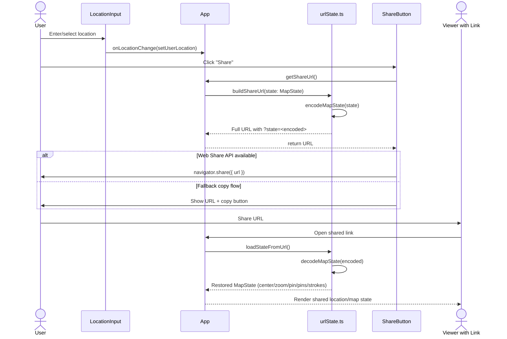

# Leafspots 🍃🍺

Leafspots is a map-first React + Vite SPA for drawing, pinning, and sharing places through a URL.

## Installation & Running Locally

```bash
git clone <repository-url>
cd leafspots
npm install
npm run dev
```

Then open the local URL shown by Vite (usually `http://localhost:5173`).

## Live Link

https://nntin.xyz/leafspots/

## Privacy

- Leafspots is a Single Page Application (SPA) with no backend.
- No user data is collected or stored on a server.
- Location and map state are encoded directly into the URL query parameter (`?state=`).
- Only people with the shared link can access that encoded location/map information.
- You are encouraged to fork this project and adapt it to your own needs.

## Architecture Diagram

The diagram below mirrors the implementation naming in the codebase (`LocationInput`, `ShareButton`, `getShareUrl`, `buildShareUrl`, `encodeMapState`, and `loadStateFromUrl`).



<p align="center"><small>Built with ♥ in preparation for Bergkirchweih, my hometown for the years 2016–2024.</small></p>